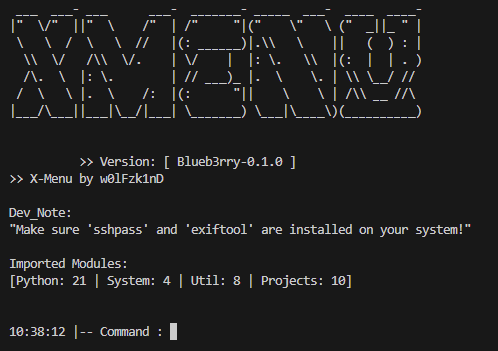
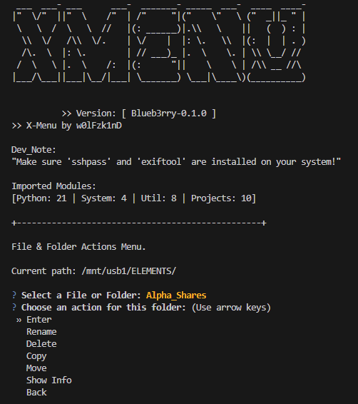

# xMenu
Simplify the usage of **headless** Linux machines *(also works on Windows)*

**Project is in Alpha Version!**

| Version      | Description     | Release Date     |
| :-------- | :------- | :------- |
| `Pinapple` | `First dev version` | 'None' |
| `Blueb3rry.0.1.0-1` | `First release` | '06.June.2024' |

First Version of this idea: https://github.com/w0lfzk1n/EzPizMenu



This project is a simple console that allows you to perform redunant actions on a headless *(console-only)* Linux server, *like a Raspberry Pi*.

At start, the project will import all nessecary Libraries *(python and custom)* into a Variable **MOD** and uses this in the Rest of the project, that means that the modules and script do not need imports.

Aswell, the Configuration files **configs/*.json** are imported into a Variable **CONFIG** and can be used troughout the project too.

All modules are called with **module(MOD, CONFIG, args)**.

It runs in a **python3 venv**, so the needed Libraries and installation will not mess up your machines setup of python <3

# Installation

*Install GIT first*

https://git-scm.com/book/en/v2/Getting-Started-Installing-Git

**Linux**
```
git clone https://github.com/w0lfzk1n/xMenu
cd xMenu
bash start.sh install
```

**Windows**
```
git clone https://github.com/w0lfzk1n/xMenu
cd xMenu
bash start.bat install
```

*Run "setup" in the console on a fresh install, to setup the config*

After this, you can run **bash start.sh start** to start the project.

Alternatively you can add an Alias *on Linux*:

```
sudo nano /etc/bash.bashrc
```

Add at the end of the file:

```
alias xmenu="cd /path/to/your/xmenu && bash start.sh start"
```

Reboot and after your should be able to run the project with **xmenu** from the bash console.

A full documentation can be found below.

---

# Disclaimer

This is a *sandbox*. I used it to improve my knowledge of python and finally complete the idea I had 2 years ago.

This project is pretty solid, but there are tons of things that can be done different and better.

For example, you are able to save Password for SSH. These are encrypted before saving them, but this encryption is not very strong, it just prevents the password to be displayed in plain-text if someone checks the file without permission.

If you like this idea/project, feel free to rework some parts or share changes with me. *You can use Pull-Requests*

---

# System Commands
| Name      | Type     | Description                | Usage     |
| :-------- | :------- | :------------------------- | :------- |
| `setup` | `system` | Runs the first setup for the config. | *setup* |
| `config` | `system` | Runs an editor for the config. | *conf*, *config* |
| `help` | `system` | Displayes the commands and infos in this project. | *help <command>* |
| `reload` | `system` | Reloads the project, without stopping it. Great if changes where made on the code. | *reload* |
| `backup` | `system` | Creates a Backup for the project. | *backup* |
| `restore` | `system` | Restore the project from a Backup. | *restore* |
| `clear` | `system` | Clears the console. | *clear* |
| `cmd` | `system` | Let's you run a command in the console outside this project. **Make sure you have setup a host and saved commands to execute** | *clear* |

---

# Project Commands
| Name      | Type     | Description                | Usage     |
| :-------- | :------- | :------------------------- | :------- |
| `run` | `projects` | This command is used to run the project modules/scripts. | *run <command> (like ytdl)* |
| `network` | `projects` | A menu to perform certain network tasks (ping, ssh, sftp, iDrac). | *netw* |
| `rsync` | `projects` | A menu to perform rsync actions, also allows to select external hosts as destination. | *run rsync* |
| `ytdl` | `projects` | A menu that allows you to download YouTube and *other* videos from websites. **Make sure 'paths/media/ytdl_save_paths' are setup!** | *run ytdl* |
| `metadata` | `projects` | A menu to perform actions for video and imagefiles to edit, remove metadata. | *run meta* |
| `cyberdrop` | `projects` | Launches a external script that allows you to download stuff from sites like *simpcity*. https://github.com/Jules-WinnfieldX/CyberDropDownloader/releases | *run cyberd* |
| `dupeyeet` | `projects` | A menu to perform scans for Video and Imagefiles, to find and remove duplicates. | *run dupe* |
| `mediaconvert` | `projects` | A menu that allows you to convert all **mkv** files in a folder to **mp4** using FFMPEG Docker. | *run convert* |
| `blkrename` | `projects` | A menu that allows you to rename all files of a certain type, with a random or own name. | *run blkr* |
| `filemanager` | `projects` | A menu that allows you to browse your files/folders and perform actions like *delete, move, copy, rename*. | *run manager* |



---

# Developer Commands
| Name      | Type     | Description                | Usage     |
| :-------- | :------- | :------------------------- | :------- |
| `listjson` | `projects` | This command allows you to see the config. | *listjson*, *listjosn core*, *listjson paths* |
| `dev` | `projects` | This command allows you to run the **modules/projects/dev.py**, which can be used to develop new modules and things. | *dev* |


---

# Detailed documentation

## Configs

### core.json

```
{
    "core": {
        "default_host": "",      <-- [Default Host to use.]
        "coredata": {
            "py_sys_modules": [  <-- [Python libraries to import at start.]
                "os", <-- [Single library.]
                {
                    "namelist": [
                        "AES"
                    ],
                    "from": [
                        "Crypto.Cipher"
                    ]
                } <-- [Import specific from Library (from crypto.Cipher import AES)]
            ],
            "secret_phrase": "s02ZTCfSs7dV5VeasdoasgfFsFFyk", <-- [Secret Phrase to encrypt and decrypt strings.]
            "enc_tag": "ENC-"  <-- [Indicator for Encrypted strings]
        },
        "cpaths": {
            "project_path": "", <-- [Path to the project, leave EMPTY, will be added on start of script!]
            "configs": { <-- [Paths to the config files]
                "core": "configs/core.json",
                "cmd": "configs/cmd.json",
                "defaults": "configs/defaults.json",
                "hosts": "configs/hosts.json",
                "lang": "configs/lang.json",
                "paths": "configs/paths.json",
                "wordlist": "configs/wordlist.json"
            },
            "module_path": "modules/", <-- [Path to the modules]
            "data": "data/" <-- [Path for the module data (links for ytdl module)]
        },
        "runtime": { <-- [Input keys for exiting something]
            "exit_keys": [
                "q",
                "Q",
                "quit",
                "exit",
                "stop",
                "x"
            ]
        }
    }
}
```

---

### cmd.json

```
{
    "dev": { <-- [Command Key (make sure this key is also in the 'aliases') ]
        "title": "Dev Commands", <-- [Command title]
        "usage": "dev",  <-- [Visual display of usage]
        "is_project": false, <-- [If true, needs 'run' in console to exec]
        "core_modulepack": "projects", <-- [Folder where module is located]
        "sub_modulepack": "dev", <-- [Filename of module without *.py]
        "function_call": "dev", <-- [Function to call from this file]
        "need_args": false, <-- [If command need arguments]
        "args": [], <-- [Titles for needed commands]
        "aliases":
            "dev"
        ], <-- [Words/Commands that trigger the module from the xmenu-console. Must include the Command Key!]
        "content": "This is the developer command. This area is for testing and debugging.\n>> You can edit the file to develop new modules.\n>> Usage: 'dev'" <-- [Helptext]
    }
}
```

---

### hosts.json
```
{
    "host-name": { <-- [The name that will be displayed when a host need to be selected]
        "ipadr": [
            "192.168.0.35",
            "192.168.0.133",
            "192.168.191.67"
        ], <-- [The saved IP addresses for the host (needed when Host should be used as external destination in 'sftp' or 'rsync']
        "mac-addr": "dc:a6:32:f9:7d:42", <-- [MAC-Address, is currently not used anywhere, but WakeOnLan Module is planned]
        "users": { <-- [Dictionary for saved users of this host, used to perform 'ssh', 'sftp' and 'rsync' with 'sshpass']
            "Mumpi": { <-- [Displayname for the user, in selection menus]
                "u": "pi", <-- [User]
                "p": "ENC-nOKasdaAaf00uXYB+w==" <-- [Encrypted password]
            }
        },
        "enc-keys": {}, <-- [Dictionary for encryption keys, not used currently]
        "paths": { <-- [The paths for this host]
            "as_runtime": [ <-- ['as_runtime' is used when a local path is needed by a module]
                "/mnt"
            ],
            "as_ext_host": [ <-- ['as_ext_host' is used when a external path is needed by a module like 'rsync' or 'sftp']
                "/mnt/Programming/subscripts/xmenu/Backups/",
                "/mnt/Alpha_Shares/",
                "/mnt"
            ]
        },
        "commands": [ <-- [Saved commands for this host, that can be executed outside of this project]
            "echo 'w0lFzk1nD is awesome!'",
            "sudo systemctl status ssh"
        ]
    }
}
```

---

### lang.json

This config is for text and other visual elements within the project.

---

### paths.json

This config is the **dump** config, which can be used for all sorts of configs needed.

```
{
    "media": {
        "valid_rename_extensions": [ <-- [Valid file extension for the blkrename module]
            ".avi",
            ".doc",
            ".docx",
            ".gif",
            ".jpeg",
            ".jpg",
            ".mkv",
            ".m4v",
            ".mov",
            ".mp3",
            ".mp4",
            ".mpeg",
            ".pdf",
            ".png",
            ".rar",
            ".txt",
            ".wav",
            ".zip"
        ],
        "rename_exclude_part": [ <-- [Parts that will raise a skip for a file when renaming with blkrename module]
            ".part",
            ".ydtl"
        ],
        "ytd_save_paths": [ <-- [Paths to save downloaded stuff from the ytdl module]
            "Media/YouTube/Music/",
            "Media/YouTube/Videos/",
        ],
        "ytd_path": "data/ytdl/", <-- [Path to ytdl things, like 'links.txt']
        "core_paths": { <-- [Corepaths are used as default by most of the modules for a host]
            "host": "/mnt/",
        }
    }
}
```
